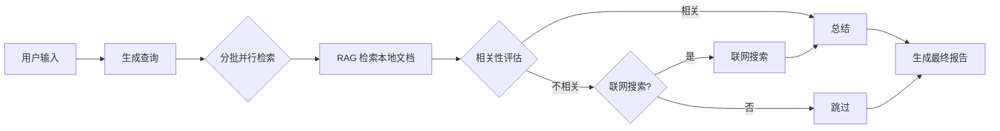

# 🤖 RAG问答分析助手

[](https://www.python.org/)
[](https://langchain-ai.github.io/langgraph/)
[](https://ollama.com/)
[](LICENSE)

## 项目介绍

基于 **LangGraph** 构建的智能 RAG（检索增强生成）研究智能体。接入本地 **Ollama** 推理模型，自动检索本地文档并生成结构化分析报告。当本地知识库不足时，可自动回退到联网搜索。

适合需要从大量文档中快速提取见解的研究人员、分析师和开发者。

## 功能特性

- 🧠 **智能查询生成**：自动将用户问题拆解为多个精准搜索查询
- 📚 **本地 RAG 检索**：基于 ChromaDB 向量库，从上传文档中检索相关内容
- 🔍 **相关性评估**：自动判断检索结果是否与查询相关
- 🌐 **联网搜索回退**：本地文档不足时，通过 Tavily API 联网补充
- 📝 **结构化报告**：按自定义模板生成格式统一的分析报告
- 🖥️ **可视化界面**：Streamlit 构建的 Web UI，支持文档上传与实时流式输出

## 快速开始

### 环境要求

- **Python** 3.10+
- **Ollama** 已安装并启动（`ollama serve`）
- **操作系统**：Windows / Linux / macOS

### 安装

```bash
# 克隆仓库
git clone <your-repo-url>.git
cd ChatBot

# 创建虚拟环境（推荐）
python -m venv .venv
.venv\Scripts\activate     # Windows
# source .venv/bin/activate  # Linux/macOS

# 安装依赖
pip install -r requirements.txt

# 拉取本地模型（如未安装）
ollama pull deepseek-r1:1.5b
```

### 配置环境变量

在项目根目录创建 `.env` 文件：

```env
# Tavily API Key（用于联网搜索，可选）
TAVILY_API_KEY=your_tavily_api_key_here

# OpenRouter API Key（切换外部 LLM 时使用，可选）
OPENROUTER_API_KEY=your_openrouter_api_key_here
```

> 获取 Tavily API Key：[https://tavily.com](https://tavily.com)（免费额度可供日常使用）

### 准备文档

将需要检索的文档（`.txt` / `.pdf` / `.csv` / `.md`）放入 `files/` 目录，首次运行时向量库会自动创建。

### 启动

```bash
# Web 界面
streamlit run app.py

# 命令行模式
python client.py
```

启动后在浏览器中打开 `http://localhost:8501`，即可在左侧边栏上传文档、配置参数，在对话框中输入问题开始研究。

## 常见用法

### 用法一：Web 界面交互

```bash
streamlit run app.py
```

在侧边栏中：
1. 选择报告模板
2. 设置最大搜索请求数（1-10）
3. 勾选是否启用联网搜索
4. 上传文档并点击"记忆该文档"
5. 在对话框输入研究问题

### 用法二：命令行批量研究

```bash
# 编辑 client.py 中的 user_instructions 和 config，然后运行
python client.py
```

适合脚本化批量研究任务。

### 用法三：自定义报告模板

在 `reply template/` 目录下创建新的 `.md` 模板文件，即可在 Web UI 的下拉菜单中选择。

模板格式示例：

```markdown
# 报告摘要
简要概述...

# 背景与目的
...

# 结论与建议
...

# 参考文献
...
```

## 配置说明

所有配置通过 Web UI 侧边栏或 `client.py` 中的 `config` 字典管理。

| 配置项 | 类型 | 默认值 | 说明 |
|--------|------|--------|------|
| `enable_web_search` | bool | `True` | 是否启用 Tavily 联网搜索回退 |
| `max_search_queries` | int | `5` | 单次研究的最大搜索查询数（1-10） |
| `report_structure` | string | `template1` | 报告输出模板，可选 `reply template/` 目录下的模板 |

### 环境变量（`.env`）

| 变量 | 必需 | 说明 |
|------|------|------|
| `TAVILY_API_KEY` | 联网搜索时必需 | Tavily 搜索 API 密钥 |
| `OPENROUTER_API_KEY` | 切换外部 LLM 时必需 | OpenRouter API 密钥 |

## 项目架构

```
ChatBot/
├── app.py                 # Streamlit Web 界面入口
├── client.py              # 命令行测试入口
├── requirements.txt       # Python 依赖
├── .env                   # 环境变量（需自行创建）
├── langgraph.json         # LangGraph Studio 配置
├── Module/                # 核心模块
│   ├── graph.py           # LangGraph 主图 + 子图定义
│   ├── state.py           # 状态类型定义（TypedDict）
│   ├── configuration.py   # 运行配置类
│   ├── prompts.py         # LLM Prompt 模板
│   ├── utils.py           # 工具函数（LLM 调用、搜索、解析）
│   ├── vector_db.py       # ChromaDB 向量库管理
│   └── __init__.py        # 模块导出
├── files/                 # 待检索的文档目录
├── reply template/        # 报告输出模板
└── all-MiniLM-L6-v2/      # 本地嵌入模型文件
```

## 工作流程



## 注意事项

- **Ollama 必须运行**：启动前确保 `ollama serve` 在后台运行
- **首次启动较慢**：向量库构建和模型加载需要一定时间
- **路径调整**：`vector_db.py` 中嵌入模型路径使用了绝对路径，在新环境需修改为相对路径
- **切换外部 LLM**：`graph.py` 和 `utils.py` 中保留了 OpenRouter 注释代码，取消注释即可使用 GPT-4o-mini 等外部模型

## 开源协议

本项目采用 [MIT License](LICENSE)。

## 参与贡献

欢迎提交 Issue 和 Pull Request。
